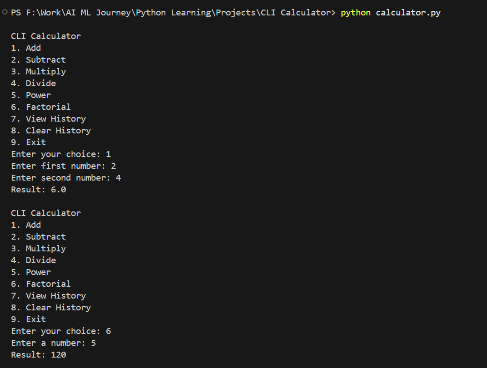
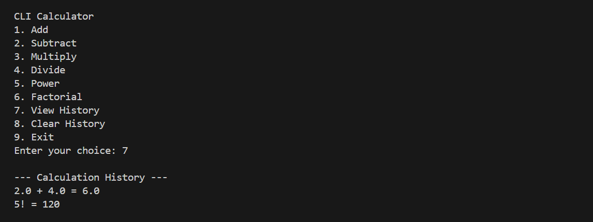

# CLI Calculator

A command-line calculator built in Python that supports basic arithmetic, hand-written recursive power and factorial functions, and a persistent calculation history saved between runs.

This is the first project in my AI-engineer learning roadmap, built to consolidate Python fundamentals: variables, conditionals, loops, functions, recursion, and file I/O.

## Features

- Menu-driven interface that loops until the user exits
- Addition, subtraction, multiplication, and division
- Division by zero handled gracefully — no crash
- Power (x^n) implemented as a hand-written recursive function (no `**` or `pow()`)
- Factorial (n!) implemented as a hand-written recursive function (no `math.factorial`)
- Every calculation logged to `history.txt`, with expression and result
- View past history from the menu
- Clear history from the menu, with a confirmation prompt
- Robust input handling — invalid numbers and menu choices are caught and re-prompted, never crash the program
- History persists across program runs

## Project Structure
cli-calculator/
├── calculator.py # Main program: menu loop, user input, history read/write
├── operations.py # Pure arithmetic functions, including the two recursive functions
├── history.txt # Generated at runtime, stores calculation history (gitignored)
└── README.md

`operations.py` contains only pure functions — no printing or file access — so the math logic stays independent of how the user interacts with the program. All menu display, input handling, and file I/O live in `calculator.py`.

## How to Run
python calculator.py

## Example Menu
CLI Calculator
1.Add
2.Subtract
3.Multiply
4.Divide
5.Power
6.Factorial
7.View History
8.Clear History
9.Exit

## Screenshot

## What I Learned

- How to structure a small Python project across multiple modules, separating pure logic from user interaction
- How to design and trace recursive functions with correct base cases (power, factorial)
- How to read from and write to files for persistent storage, and handle missing-file edge cases
- How to use `try`/`except` to keep a program robust against invalid input and runtime errors
- Why repeated code should be pulled into helper functions (e.g. `get_number`, `log_history`)

